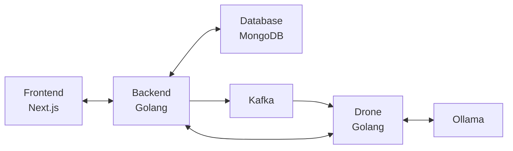

# Kayori

> [!WARNING]
> This project is the early stages of development. Most features have not been implemented. Do not deploy to production.

## Overview

Kayori is an intelligence-gathering and analysis platform designed for investigators, analysts, and cybersecurity professionals. The platform provides tools for data collection, social media monitoring, LLM-powered automation, and advanced entity correlation.

Use cases include tracking emerging threats, mapping out social networks, and managing complex investigations.

## Planned Features

- **Real-time Data Ingestion**: Collect and process data from multiple sources in real-time
- **Social Media Monitoring**: Track and analyze social media activity across platforms
- **LLM-Powered Automation**: Leverage large language models for automated analysis and insights
- **Advanced Entity Correlation**: Connect related entities and uncover hidden relationships
- **Scalable Architecture**: Deploy on a single machine or scale across multiple nodes
- **Modern UI**: Intuitive interface built with Next.js and Tailwind CSS

## Architecture

Kayori uses microservices to provide a flexible and scalable architecture.

### Components

- **Frontend**: Next.js with Tailwinds and DaisyUI
- **Backend API**: Golang REST API
- **Database**: MongoDB for flexible document storage
- **Job Worker (Drone)**: Golang service for processing background tasks
- **Message Queue**: Kafka for reliable job distribution and event streaming
- **LLM Service**: Ollama for vector embeddings and local LLM inference

### System Design



## Getting Started

### Prerequisites

- Docker and Docker Compose
- Node.js 18+

### Installation

1. Clone the repository:
   ```bash
   git clone https://github.com/emerson000/kayori.git
   cd kayori
   ```

2. Start the development environment:
   ```bash
   docker-compose up -d
   ```

> [!NOTE]
> The frontend experiences some performance issues when running locally. It is recommended to run the frontend on your host using `npm run dev`.

3. Access the application:
   ```
   Frontend: http://localhost:3000
   API: http://localhost:3001
   ```

## Roadmap

### Foundation
- [x] Project setup and architecture design
- [x] Basic frontend and backend implementation
- [ ] Authentication
- [ ] RBAC and user management
- [ ] Plugin system for job workers


### Projects
- [ ] Dashboard
- [ ] Alerts
- [ ] Collaboration

#### Collection
- [ ] Website scraping
  - [X] RSS feeds
  - [ ] Webpage monitoring (Xpath, etc.)
  - [ ] Live video stream transcription
- [ ] Social media collection
  - [ ] BlueSky
  - [ ] Discord
  - [ ] Facebook
  - [ ] Reddit
  - [ ] Instagram
  - [ ] TikTok
  - [ ] Telegram
  - [ ] Truth Social
  - [ ] Twitch
  - [ ] Twitter
  - [ ] YouTube
- [ ] Ingest data from other projects

#### Processing
- [ ] Deduplication
- [ ] Entity extraction and relationship modeling
- [ ] Sentiment analysis
- [ ] Watchlist matching
- [ ] Clustering

#### Analysis
- [ ] Data queries and filtering
- [ ] Graph visualization
- [ ] LLM-powered analysis

#### Dissemination
- [ ] Report generation
- [ ] External sharing
- [ ] Publish to API

## Contributing

Contributions are welcome to Kayori. Please see our [Contributing Guidelines](CONTRIBUTING.md) for details on how to submit pull requests, report issues, and contribute to the project.

## License

Kayori is licensed under the [MIT License](LICENSE).

## Contact

For questions or support, please contact [kayori@emerson.sh](mailto:kayori@emerson.sh).